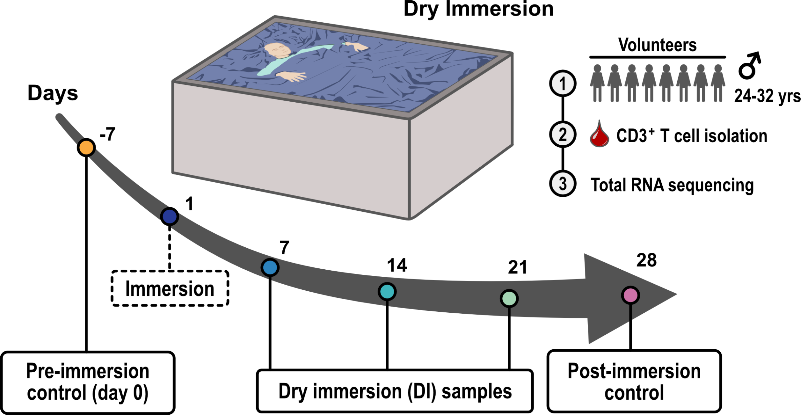

# T Cell Dry Immersion Bed Study

This repository contains necessary files to evaluate and reproduce the core data analysis steps
of the T cell dry immersion (DI) bed study. The effects of weightlessness on T cell gene expression 
are investigated using this ground-based model of microgravity. Volunteers were exposed to DI 
during a 3-week period in which weekly blood samples were collected, in addition to pre- and post-immersion
control samples drawn 7 days before and after DI, respectively. CD3+ T cells were isolated 
followed by RNA sequencing.

|  |
|:--:|
| ***Overview figure of the experimental design.*** |

## Data availability

> Raw high-throughput sequencing files have been deposited at the European
> Genome-phenome Archive (EGA) under accession number **EGAS00001006846**.

## Citation

If using the data or code for analysis please cite the [study]().

> Exposure of volunteers to dry immersion bed over 21 days results in gene 
> expression changes and adaptation of T cells.
